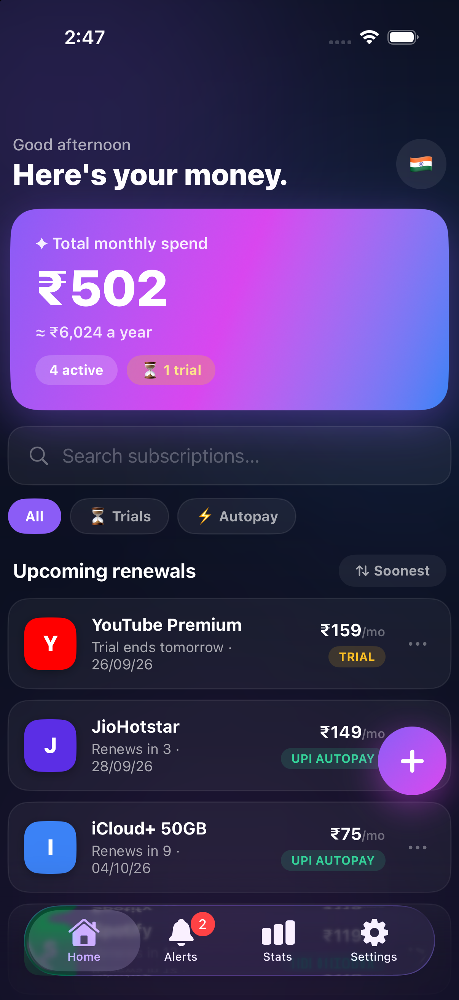
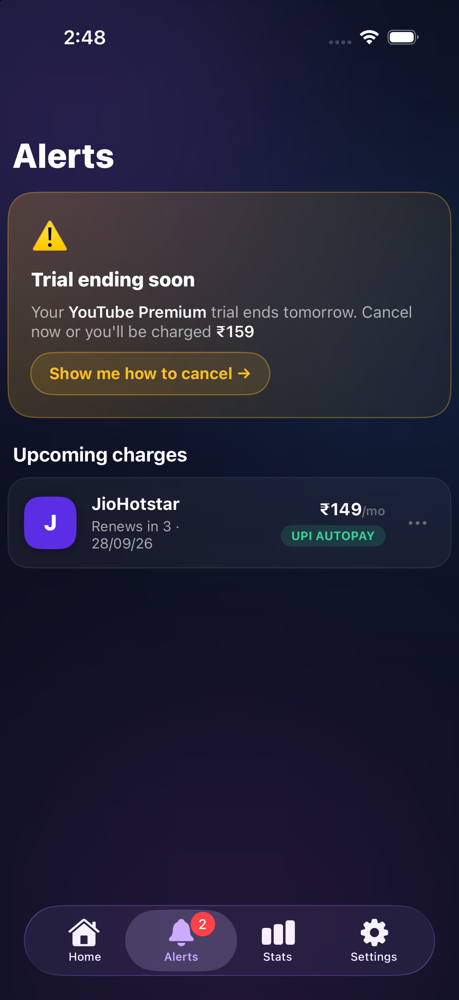
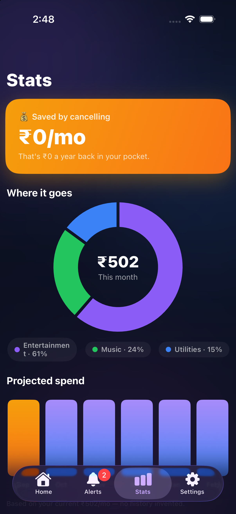
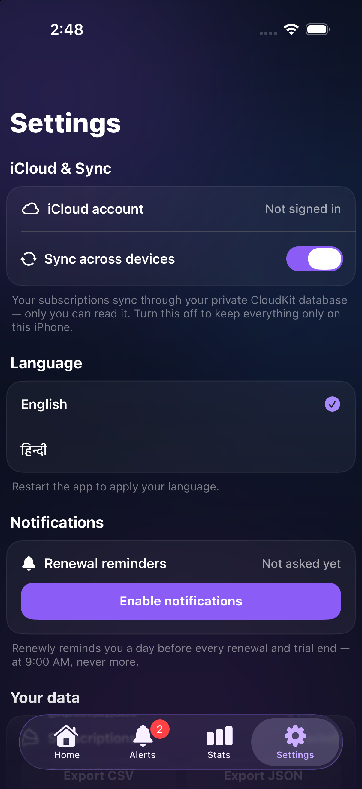

# 💜 Renewly

**Every subscription. Every trial. Zero surprises.**

*The subscription tracker that respects your wallet — and your privacy.*

[Features](#-features) · [Screenshots](#-screenshots) · [Get Started](#-get-started) · [Privacy](#-privacy) · [License](#-license)

---

## 📸 Screenshots

| Home | Alerts | Stats | Settings |
|:---:|:---:|:---:|:---:|
|  |  |  |  |

## ✨ Why Renewly

Most trackers either demand your bank login, sell your data, or miss the basics. Renewly is different:

- 🔔 **Trial-ending alerts** — never pay for a trial you forgot about
- 📈 **Price-change tracking** — get notified the moment a service raises its price, with full history
- 🧾 **Honest annual-plan nudges** — real math from your own data, never invented prices
- 🔍 **Overlap detection** — spots when you're paying twice in the same category
- 🌍 **9 countries, native currencies** — ₹ with lakh/crore grouping for India, UPI Autopay labels
- 🗣️ **English + हिन्दी** — switch languages right inside the app
- 🔒 **Private by design** — on-device storage, optional iCloud sync, no accounts, no ads, no tracking

## ✨ Features

| Tab | What it does |
|-----|--------------|
| 🏠 **Home** | Animated spend card, yearly projection, search, Trials/Autopay filters, sort by soonest or price |
| ⏰ **Alerts** | Trial warnings with step-by-step cancel guides (incl. UPI Autopay revoke), 7-day renewal reminders, price-change feed |
| 📊 **Stats** | Gold savings card, category donut, 6-month forward projection, biggest-spend insight, cancelled list with restore |
| ⚙️ **Settings** | iCloud sync status + toggle, language picker, notification controls, CSV/JSON export, App Store review prompt |

Real iOS **local notifications** fire a day before every renewal and trial end — at 9:00 AM, never more.

## 🛠 Tech Stack

| Layer | Choice |
|-------|--------|
| UI | SwiftUI + Swift Charts |
| Data | SwiftData · optional CloudKit sync (graceful local fallback) |
| Notifications | UserNotifications (local, no server) |
| Localization | String Catalogs — English + Hindi |
| Privacy | Privacy manifest · zero third-party SDKs |

## 🚀 Get Started

1. Install **Xcode** from the Mac App Store (free).
2. Double-click `Renewly.xcodeproj` in this folder.
3. Select the **Renewly** target → **Signing & Capabilities** → choose your Apple ID team.
4. Pick an iPhone simulator (or your iPhone) and press **▶ Run**.

**App icon** — no Terminal needed. Double-click **`Install-Icon.html`** in this folder, click **Download AppIcon-1024.png**, then drag that PNG onto the **AppIcon** well in `Assets.xcassets` (or into `Renewly/Assets.xcassets/AppIcon.appiconset/` in Finder). Rebuild — the warnings disappear and the new icon appears on the home screen.

**iCloud sync (optional)** — Xcode → target → *Signing & Capabilities* → **+ Capability** → **iCloud** → tick **CloudKit** with container `iCloud.com.renewly.app`. Without it, the app simply works locally.

## 📸 Adding / Refreshing Screenshots

1. Run the app in an iPhone simulator.
2. Open each tab — **Home**, **Alerts**, **Stats**, **Settings** — and press **⌘S**.
3. Move the four PNGs into `screenshots/` named exactly:
   `home.png` · `alerts.png` · `stats.png` · `settings.png`
4. Commit & push — the table above picks them up automatically.

## 🔒 Privacy

- No accounts. No ads. No analytics. No tracking SDKs.
- Data lives on-device (SwiftData) and optionally in the user's **private** CloudKit database — we can't see any of it.
- `PrivacyInfo.xcprivacy` declares: tracking disabled, no data collected.

## 📄 License

**Proprietary — All rights reserved.** This is a private repository. No part of this project — code, design, images, or docs — may be copied, modified, or distributed without prior written permission. See [LICENSE](LICENSE).

---

Made with 💜 for everyone who's ever paid for a forgotten free trial.

